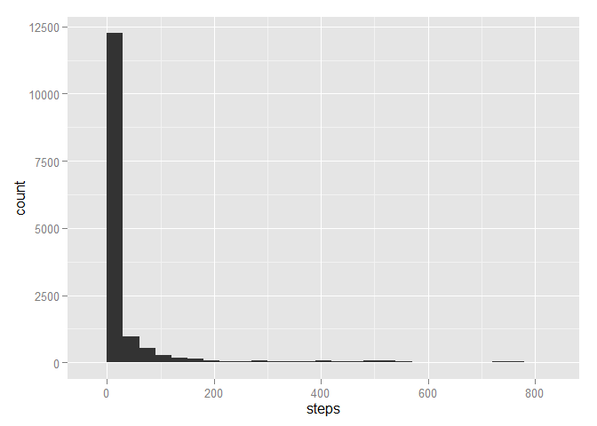
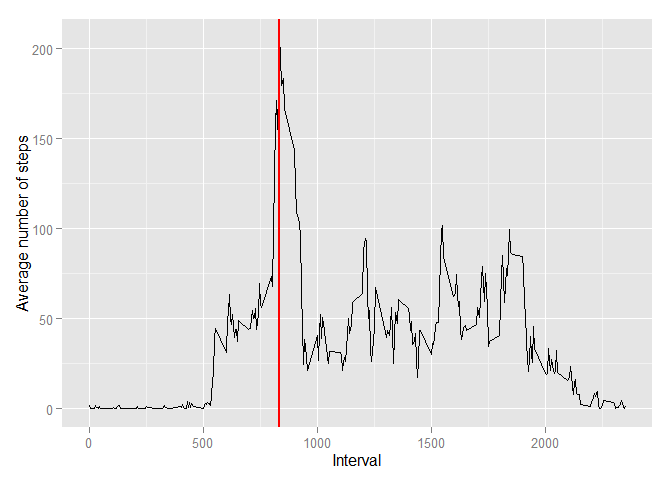
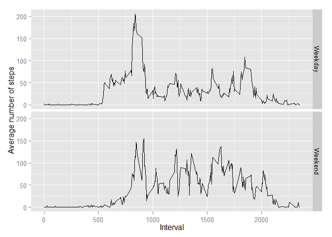

# Reproducible Research: Peer Assessment 1


## Loading and preprocessing the data

```r
# Read data
data <- read.csv("activity.csv")

# Transform date column to date format using lubridate library
library(lubridate)
data$date <- ymd(data$date)

# Transform dataset to tbl_df format using the dplyr library
library(dplyr)
```

```
## 
## Attaching package: 'dplyr'
## 
## The following objects are masked from 'package:lubridate':
## 
##     intersect, setdiff, union
## 
## The following objects are masked from 'package:stats':
## 
##     filter, lag
## 
## The following objects are masked from 'package:base':
## 
##     intersect, setdiff, setequal, union
```

```r
data <- tbl_df(data)
```

## What is mean total number of steps taken per day?

```r
# Make a histogram of the total number of steps taken each day
library(ggplot2)
qplot(x = steps, data = data, binwidth = 30)
```

 

```r
# Calculate and report the mean and median total number of steps taken per day
# Mean
mean.value <- with(data, mean(steps, na.rm = TRUE))

# Median
median.value <- with(data, median(steps, na.rm = TRUE))
```

The mean total number of steps taken per day is **37.3825996**.
The median total number of steps taken per day is **0**.

## What is the average daily activity pattern?

```r
# Make a time series plot (i.e. type = "l") of the 5-minute interval (x-axis) and the average number of steps taken, averaged across all days (y-axis)
# Group data by interval and summarise the mean of the steps
average.steps <- data %>%
    group_by(interval) %>%
    summarise(mean(steps, na.rm = TRUE))
names(average.steps) <- c("interval", "ave.step")

# Plot
q <- qplot(x = interval, y = ave.step, data = average.steps, geom = "line",
           xlab = "Interval", ylab = "Average number of steps")
q
```

 

```r
# Which 5-minute interval, on average across all the days in the dataset, contains the maximum number of steps?
max.steps <- which.max(average.steps[ , 2])
max.interval <- average.steps[ , 1][max.steps]

q + geom_vline(aes(xintercept = max.interval), col = "red", size = 1)
```

 

The **835**-minute interval contains the maximum number of steps on average across all the days in the dataset.

## Imputing missing values

```r
# Calculate and report the total number of missing values in the dataset (i.e. the total number of rows with NAs)
summary(data)
```

```
##      steps             date               interval     
##  Min.   :  0.00   Min.   :2012-10-01   Min.   :   0.0  
##  1st Qu.:  0.00   1st Qu.:2012-10-16   1st Qu.: 588.8  
##  Median :  0.00   Median :2012-10-31   Median :1177.5  
##  Mean   : 37.38   Mean   :2012-10-31   Mean   :1177.5  
##  3rd Qu.: 12.00   3rd Qu.:2012-11-15   3rd Qu.:1766.2  
##  Max.   :806.00   Max.   :2012-11-30   Max.   :2355.0  
##  NA's   :2304
```

From the summary, we can observe that there are 2304 missing values (NAs) within the **steps** variable. The other two variables (**date** and **interval**) have no NAs.


```r
# Check where are the NAs
NAs.by.date <- data %>%
    group_by(date) %>%
    summarise(sum(is.na(steps)))
names(NAs.by.date) <- c("date", "NAs")
NAs.by.date
```

```
## Source: local data frame [61 x 2]
## 
##          date NAs
## 1  2012-10-01 288
## 2  2012-10-02   0
## 3  2012-10-03   0
## 4  2012-10-04   0
## 5  2012-10-05   0
## 6  2012-10-06   0
## 7  2012-10-07   0
## 8  2012-10-08 288
## 9  2012-10-09   0
## 10 2012-10-10   0
## 11 2012-10-11   0
## 12 2012-10-12   0
## 13 2012-10-13   0
## 14 2012-10-14   0
## 15 2012-10-15   0
## 16 2012-10-16   0
## 17 2012-10-17   0
## 18 2012-10-18   0
## 19 2012-10-19   0
## 20 2012-10-20   0
## 21 2012-10-21   0
## 22 2012-10-22   0
## 23 2012-10-23   0
## 24 2012-10-24   0
## 25 2012-10-25   0
## 26 2012-10-26   0
## 27 2012-10-27   0
## 28 2012-10-28   0
## 29 2012-10-29   0
## 30 2012-10-30   0
## 31 2012-10-31   0
## 32 2012-11-01 288
## 33 2012-11-02   0
## 34 2012-11-03   0
## 35 2012-11-04 288
## 36 2012-11-05   0
## 37 2012-11-06   0
## 38 2012-11-07   0
## 39 2012-11-08   0
## 40 2012-11-09 288
## 41 2012-11-10 288
## 42 2012-11-11   0
## 43 2012-11-12   0
## 44 2012-11-13   0
## 45 2012-11-14 288
## 46 2012-11-15   0
## 47 2012-11-16   0
## 48 2012-11-17   0
## 49 2012-11-18   0
## 50 2012-11-19   0
## 51 2012-11-20   0
## 52 2012-11-21   0
## 53 2012-11-22   0
## 54 2012-11-23   0
## 55 2012-11-24   0
## 56 2012-11-25   0
## 57 2012-11-26   0
## 58 2012-11-27   0
## 59 2012-11-28   0
## 60 2012-11-29   0
## 61 2012-11-30 288
```

Futhermore, we can identify when the NAs were recorded. These belong to **8** days of inactivity on:

+ 2012-10-01
+ 2012-10-08
+ 2012-11-01
+ 2012-11-04
+ 2012-11-09
+ 2012-11-10
+ 2012-11-14
+ 2012-11-30


```r
# Devise a strategy for filling in all of the missing values in the dataset. The strategy that is followed is to substitute the NAs with the median for a particular 5-minute interval.
# Compute the median for each interval
median.steps <- data %>%
    group_by(interval) %>%
    summarise(median(steps, na.rm = TRUE))
names(median.steps) <- c("interval", "median.step")

# Get the dates with NAs
dates.w.NAs <- subset(NAs.by.date, NAs > 0)[ , 1]

# Create a new dataset that is equal to the original dataset but with the missing data filled in.
for (date in dates.w.NAs) {
    data$steps[data$date == date] <- median.steps$median.step
}
summary(data)
```

```
##      steps          date               interval     
##  Min.   :  0   Min.   :2012-10-01   Min.   :   0.0  
##  1st Qu.:  0   1st Qu.:2012-10-16   1st Qu.: 588.8  
##  Median :  0   Median :2012-10-31   Median :1177.5  
##  Mean   : 33   Mean   :2012-10-31   Mean   :1177.5  
##  3rd Qu.:  8   3rd Qu.:2012-11-15   3rd Qu.:1766.2  
##  Max.   :806   Max.   :2012-11-30   Max.   :2355.0
```

```r
# Make a histogram of the total number of steps taken each day and Calculate and report the mean and median total number of steps taken per day. Do these values differ from the estimates from the first part of the assignment? What is the impact of imputing missing data on the estimates of the total daily number of steps?
qplot(x = steps, data = data, binwidth = 30)
```

 

```r
# Calculate and report the mean and median total number of steps taken per day
# Mean
mean.value <- with(data, mean(steps, na.rm = TRUE))

# Median
median.value <- with(data, median(steps, na.rm = TRUE))
```

Using the new dataset, the mean total number of steps taken per day is **32.9995446**. Also, the median total number of steps taken per day is **0**. The median value remains the same but the mean value is reduced by 4.383055 units. A statistical analysis should be performed to determine if this difference is statistically significant. Imputing any missing data will provide 
larger training and validation datasets for further use. However, this is not a trivial task because imputing missing data can produce biased results.

## Are there differences in activity patterns between weekdays and weekends?

```r
# Function to classify either Weekend or Weekday
wday.wend <- function(x) {ifelse(weekdays(x) %in% c("Saturday", "Sunday"), "Weekend", "Weekday")}

# Modify dataset, group data by part.of.week and interval
data.by.part <- data %>%
    mutate(part.of.week = as.factor(wday.wend(date))) %>%
    group_by(part.of.week, interval) %>%
    summarise(mean(steps, na.rm = TRUE))
names(data.by.part) <- c("part.of.week", "interval", "ave.step")

# Plot
q <- qplot(x = interval, y = ave.step, data = data.by.part,
           facets = part.of.week ~ ., geom = "line",
           xlab = "Interval", ylab = "Average number of steps")
q
```

 

